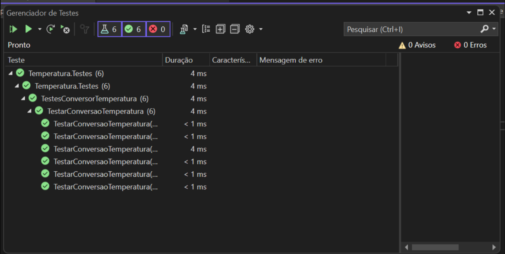
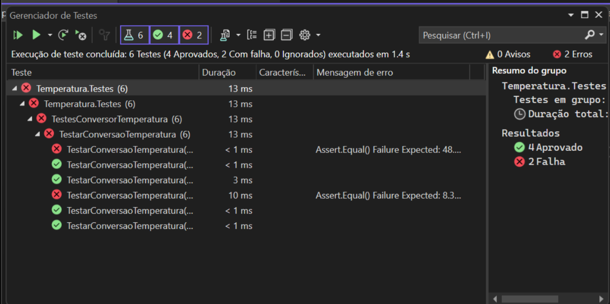
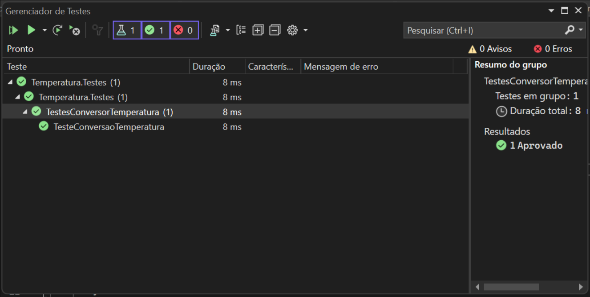
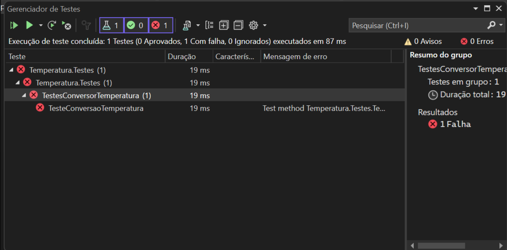
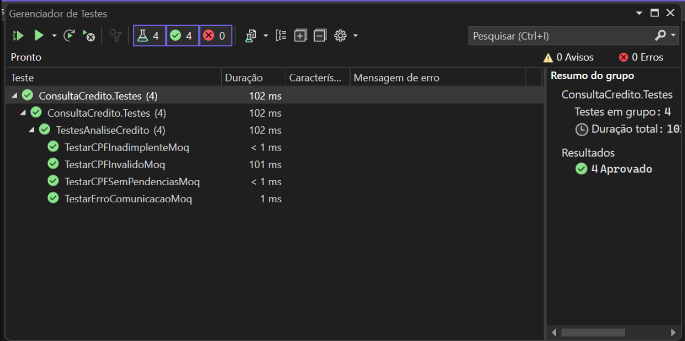

# Testes de Software 

## Testes - xUnit

Um teste de unidade é um método de teste que verifica componentes ou métodos individuais de software, também conhecidos como "unidades de trabalho". Esses testes devem focar apenas no código controlado pelo desenvolvedor, excluindo questões de infraestrutura, como bancos de dados, sistemas de arquivos e recursos de rede.

Os testes são estruturados utilizando os atributos Theory e InlineData, que permitem a execução de testes parametrizados. Isso possibilita fornecer vários conjuntos de entradas e saídas esperadas para o mesmo teste, aumentando a cobertura de testes sem a necessidade de escrever métodos de teste separados para cada cenário. O método Assert.Equal é utilizado para verificar se o resultado da conversão corresponde ao valor esperado, considerando uma precisão de 1 ponto decimal.

### Testes com caso de sucesso

### Testes que falharam

## Testes - MSTest

MSTest é o framework de testes unitários que possibilita aos desenvolvedores verificar o comportamento do código de forma isolada e automatizada. Ele oferece suporte a uma variedade de testes, incluindo testes de unidade básicos, testes parametrizados e testes dirigidos por dados.

### Testes com caso de sucesso

### Testes que falharam

## Testes - Moq

Mock Objects são essenciais no desenvolvimento de software e na criação de testes unitários, simulando o comportamento de objetos reais em um ambiente controlado. Eles permitem testar componentes de forma isolada, evitando interações com dependências externas complexas. O Moq, um framework dinâmico para .NET, oferece a criação simples e declarativa de Mock Objects, permitindo configurações detalhadas de comportamento, verificação de chamadas a métodos e execução de ações.

### Testes com caso de sucesso

